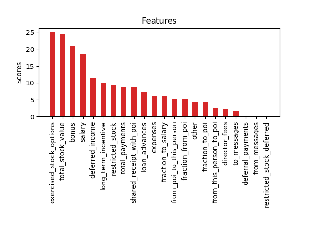

# Identify Fraud from Enron Email

## Summary

The goal of this project is to build a model to identify Person of Interests (POI's) from given 
Enron email data, by using some machine learning algorithms. 
The data includes 146 different individual's email and financial records. 
The data also includes the feature labeled "poi" for these individuals, which means we already 
know the POI's. There are 18 individuals marked as POI, and 128 non-POI's. 
There are total of 21 features, 6 email features , 14 financial features and the poi label.
By using these informations, we want to build an algorithm to make predictions to identify POI's,
maybe for another similiar cases too.

But there are some problems with the dataset of course. Not every individuals have these features 
filled, or not every feature is actually useful for our model and also there is an outlier. 

- Found the features with half of the values are not valid in the data set : 
`ALL FEATURES EXCEPT 'poi' :)`
- Found the individuals whose features are %90 NaN : 
`'LOCKHART EUGENE E'`
- Found the outlier : 
`'TOTAL'`

With these results, i removed the record of TOTAL and EUGENE. 
And for the NaN features, i decided to use feature selection while training my models.

## Features

After exploring some visualisations, i decided to add three new features to the dataset.

Email features seemed very useful for calculating fractions of emails from & to POI's, so i added two
features labeled as :
- `'fraction_to_poi'`
- `'fraction_from_poi'`

And other thing that drawed my attention is the salary and total payments features.
Total payments features looks like the total of all other financial features. And the salary is the 
only stable feature in them. Other features seems to me as extra incomes. So i calculated the incomes 
except the salaries fraction of each individuals, labeled as :
- `'fraction_to_salary'`

Then i scaled the features using sklearn's `MinMaxScaler`. Because every SO questions i read about 
machine learning algorithms and their performance issues, scaling is the most suggested process.

After scaling the features, i used sklearn's `SelectKBest` feature selection algorithm to pick 
the best features that i can use in my processes. It gets all the features in the dataset, and scores
each feature depending on each other, so higher values are better.
According to [documantation of SelectKBest on sci-kit](http://scikit-learn.org/stable/modules/generated/sklearn.feature_selection.SelectKBest.html#sklearn.feature_selection.SelectKBest)
SelectKBest takes a parameter named `k`, and returns k number of best scored features, and k has a
default value of `10`.

Running this algorithm with a different `k` values [5,10,15,"all"] showed that, whatever the `k` value
is, the scores of the features are not changing. So i looked for a cut-off point between features.




And by looking at the chart above, i decided to move on with the first 4 features.

| Selected Features | Scores |
| ---------------------- | ----- |
|  exercised_stock_options  |  25.0975415287  |
|  total_stock_value  |  24.4676540475  |
|  bonus  |  21.0600017075  |
|  salary  |  18.575703268  |

The features that i added to my features list didn't come up in this table, so it seems other 
features are better indetifiers then mines.


## Algorithm

I used sklearn's `GridSearchCV` to try different algorithms with a number of different
parameters to fit our dataset. Stored all algorithms with their best parameter settings in a
dictionary with the score metrics. 
It's hard to say something about the performances of each variation, so i also stored 
each parameter's training and prediction times in that dictionary.

I also calculated a different score metric, by using all calculated results and the times.
Using this new score, i'll try to use best three algorithms.

My dictionary includes all classifiers and the parameters being tested above :

 - [SVM](http://scikit-learn.org/stable/modules/generated/sklearn.svm.SVC.html)
```
     'kernel'                   : ['poly', 'rbf', 'sigmoid'],
     'cache_size'               : [7000],
     'tol'                      : [0.0001, 0.001, 0.005, 0.05],
     'decision_function_shape'  : ['ovo', 'ovr'],
     'random_state'             : [randomState],
     'verbose'                  : [False],
     'C'                        : [100, 1000, 10000]
```

 - [RandomForest](http://scikit-learn.org/stable/modules/generated/sklearn.ensemble.RandomForestClassifier.html)
```
    'n_estimators'              : [5, 10, 25],
    'criterion'                 : ['gini', 'entropy'],
    'max_features'              : ['auto', 'sqrt', 'log2', 3, nFeatures],
    'min_samples_split'         : [2, 10, 20],
    'class_weight'              : ["balanced_subsample", "balanced"],
    'verbose'                   : [False],
    'random_state'              : [randomState]
```
    
 - [KMeans](http://scikit-learn.org/stable/modules/generated/sklearn.cluster.KMeans.html)
```
    'n_clusters'                : [4, 8, 16],
    'init'                      : ['k-means++', 'random'],
    'max_iter'                  : [50, 150, 300],
    'tol'                       : [0.0001, 0.0005, 0.001, 0.005],
    'precompute_distances'      : [True, False],
    'random_state'              : [randomState],
    'verbose'                   : [False],
    'copy_x'                    : [True, False],
    'algorithm'                 : ['full', 'elkan']
```
 - [NaiveBayes](http://scikit-learn.org/stable/modules/generated/sklearn.naive_bayes.GaussianNB.html)
```
    'priors'                    : [None]
```
 - [DecisionTree](http://scikit-learn.org/stable/modules/generated/sklearn.tree.DecisionTreeClassifier.html)
```
    'criterion'                 : ['gini', 'entropy'],
    'splitter'                  : ['best', 'random'],
    'min_samples_split'         : [2, 10, 20],
    'max_depth'                 : [None, 2, 4, 8, 16],
    'min_samples_leaf'          : [1, 3, 5, 7, 9],
    'max_leaf_nodes'            : [None, 6, 12, 24],
    'random_state'              : [randomState]
```
 - [LogisticRegression](http://scikit-learn.org/stable/modules/generated/sklearn.linear_model.LogisticRegression.html)
```
    'penalty'                   : ['l1', 'l2'],
    'tol'                       : [0.0001, 0.0005, 0.001, 0.005],
    'C'                         : [1, 10, 100, 1000, 10000, 100000, 1000000],
    'fit_intercept'             : [True, False],
    'solver'                    : ['liblinear'],
    'class_weight'              : [None, 'balanced'],
    'verbose'                   : [False],
    'random_state'              : [randomState]
```
 - [AdaBoost](http://scikit-learn.org/stable/modules/generated/sklearn.ensemble.AdaBoostClassifier.html)
```
    'n_estimators'              : [25, 50, 100],
    'algorithm'                 : ['SAMME', 'SAMME.R'],
    'learning_rate'             : [.2, .5, 1, 1.4, 2.],
    'random_state'              : [randomState]
```
 - [KNeighbors](http://scikit-learn.org/stable/modules/generated/sklearn.neighbors.KNeighborsClassifier.html)
```
    'n_neighbors'               : [2, 4, nFeatures],
    'weights'                   : ['uniform', 'distance'],
    'algorithm'                 : ['auto', 'ball_tree', 'kd_tree', 'brute'],
    'leaf_size'                 : [10, 25, 50],
    'p'                         : [2, 3, 4]
```

I intended to use best three of these algorithms. So, i'll keep going with `NaiveBayes`, `SVM` and `AdaBoost`.

| Algorithm | My Score | Accuracy | Precision | Recall | f1 | f2 | Training Time (s) | Prediction Time(s) |
| --------- | ----- | ----- | ----- | ----- | ----- | ----- |----| ---- |
|  NaiveBayes  |  2.0604  |  0.692  |  0.167  |  0.5  |  0.25  |  0.357  |  0.007  |  0.0  |
|  SVM  |  0.0227  |  0.872  |  0.333  |  0.25  |  0.286  |  0.263  |  0.915  |  0.0  |
|  AdaBoost  |  0.0061  |  0.872  |  0.4  |  0.5  |  0.444  |  0.476  |  12.647  |  0.003  |
|  LogisticRegression  |  0.0058  |  0.821  |  0.2  |  0.25  |  0.222  |  0.238  |  1.579  |  0.0  |
|  DecisionTree  |  0.0013  |  0.821  |  0.2  |  0.25  |  0.222  |  0.238  |  6.989  |  0.0  |
|  RandomForest  |  0.0003  |  0.795  |  0.167  |  0.25  |  0.2  |  0.227  |  20.907  |  0.001  |
|  KMeans  |  0.0  |  0.0  |  0.0  |  0.0  |  0.0  |  0.0  |  40.838  |  0.0  |
|  KNeighbors  |  0.0  |  0.872  |  0.0  |  0.0  |  0.0  |  0.0  |  2.356  |  0.001  |


## Tuning Parameters

Parameter tuning is a neccesary step in machine learning. By tuning the parameters, we can 
improve our predictions or we can improve our training and prediction times. Most machine learning
algorithms have a different set of parameters that we can set. There's no perfect parameter set that
can be used for all kinds of datasets. It would be true if we say, all dataset has a different best
settings, and finding the best settings of that data is the hardest part of all processes. And also
the best settings is again depends on many other things like hardware, time, tolerance of the algorithm etc.

Although, by over-tuning the parameters we can also make our algorithm to act worse in real world. 
The algorithm can be trained so well and get an overfit shape. So, while everything is great 
in test sets, it can behave really bad in big data sets and make misleading choices. 
So i think this step is kind of a trial-denial process. Yet, the feature i used in this project is
just making these trials at once and gives the best result from all possible choices. And that is 
GridSearchCV.

In the results of GridSearchCV, NaiveBayes got the highest score.
```
GaussianNB(priors=None)
```

SVM is the second highest with these parameters:
```
 SVC( C=1000, cache_size=7000, class_weight=None, coef0=0.0,
      decision_function_shape='ovo', degree=3, gamma='auto', kernel='poly',
      max_iter=-1, probability=False, random_state=42, shrinking=True,
      tol=0.0001, verbose=False)
```

And AdaBoost is the third highest with these parameters:
```
 AdaBoostClassifier(algorithm='SAMME', base_estimator=None, learning_rate=0.5,
                    n_estimators=50, random_state=42)
```

## Validation

Validation is a process, which we test our algorithms our own. 
By using the provided dataset, if we train our models with a small size of test points, we'll probably
get higher rates of score metrics, such as precision, recall and f1. Precision is the propotion of 
correctly predicted positive values to the all positive predictions. Recall is the proportion of predicted
positive values to the all positive observations. And f1 is the [harmonic mean](https://en.wikipedia.org/wiki/Harmonic_mean) of the precision and recall.

Precision is in this case the proportion of the correctly predicted POI's to the all predicted POI's.

> Precision = (Predicted as POI and it's True) / (Predicted as POI -even if it's True or False- )

Recall is in this case the proportion of the correctly predicted POI's to the correctly predicted POIs and
correctly predicted non-POI's.

> Recall = (Predicted as POI and it's True) / (Predicted as POI and it's True + Predicted as non-POI and it's True )

But getting higher rates does not mean our model predicts very good. It predicts what it learns. 
So we can say that if we train our model with a huge data, then we'll probably get better results. 
But training with huge data sets, is not always possible and also the time it takes to train our model 
would increase too.

So, with this validation step we test our algorithm with different variations of the test data by 
generating new test sets. And provided `StratifiedSuffleSplit` feature does a really great job generating
new data sets. Because of the imbalance in the data, while we split out dataset to training and test sets,we need 
to make sure that the ratio between POI's and non-POI's have the same ratio with the original data. 
Meaning, just splitting the data with a given ratio is not good enough, because it can mislead us by splitting 
the dataset as it stands. All POI's could be in stay in training set, and test set would not have any POI records.
Or POI records would be much more then non-POI's in the test set. And this will give a wrong score. 

Now we can test our algorithm with the new test data, and see the results. Since the test size got higher,
it's normal to see the score metrics to drop. I used 0.3 proportion as test-size in both algorithm selection
and validation step using `StratifiedSuffleSplit`. 

First, I did pick three different algorithms with high scores and i ran this validation for each of them. 
Then i got curiuos and ran the same test for all classifiers returned from GridSearchCV.
And among them, i choosed the best one, which is in this case `'Gaussian Naive-Bayes'`. Other algorithms 
prediction metrics dropped more with bigger test sizes and training times increased.

## Metrics & Performance

I used all available score metrics in a way, while choosing the one algorithm.
I made up a formula, that makes sense to me as above:

> (`f1_score` * `f2_score` * `precision` * `recall`) / (`Total Training and Prediction Time`)

I mentioned the metrics above for the provided dataset for each algorithms. But after using validations 
with different test sets, the one i choosed `Naive Bayes` gives the following scores with test 
sizes [100,500,1000,2000], which meets the project rubric scores for precision and recall (0.3) :

- `Accuracy`: 0.81733	`Precision`: 0.32381	`Recall`: 0.34000	`F1`: 0.33171	`F2`: 0.33663
- `Accuracy`: 0.82867	`Precision`:: 0.34426	`Recall`: 0.31500	`F1`: 0.32898	`F2`: 0.32045
- `Accuracy`: 0.82860	`Precision`:: 0.34322	`Recall`: 0.31250	`F1`: 0.32714	`F2`: 0.31820
- `Accuracy`: 0.82570	`Precision`:: 0.33503	`Recall`: 0.31200	`F1`: 0.32311	`F2`: 0.31635

>Note that the scores would change on different platforms, but on average they would give the same results.

And also,Naive-Bayes is the fastest algorithm among others.


## References:
- [Enron Email Dataset](https://www.cs.cmu.edu/~./enron/)
- [scikit-learn Documentation](http://scikit-learn.org/stable/documentation.html)
- [Introduction to Machine Learning (Udacity)](https://www.udacity.com/course/viewer#!/c-ud120-nd)
- [Ek$i Sözlük](https://eksisozluk.com/enron--219120)
- [Wiki](https://tr.wikipedia.org/wiki/Enron)

## Files
- `poi_id.py`: main submission file
- `tester.py`: producing test results for submission, provided by Udacity
- `tuning.py`: cross validations of the results, and getting the best algorithm
- `final project/`: dataset files, figures and pickle objects
- `tools/feature_format.py`: feature formatting funtions included
- `tools/util.py`: utility functions